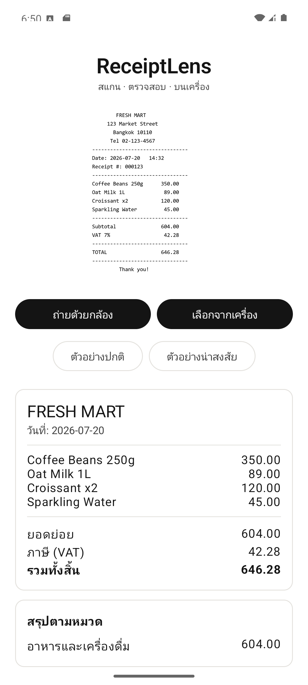
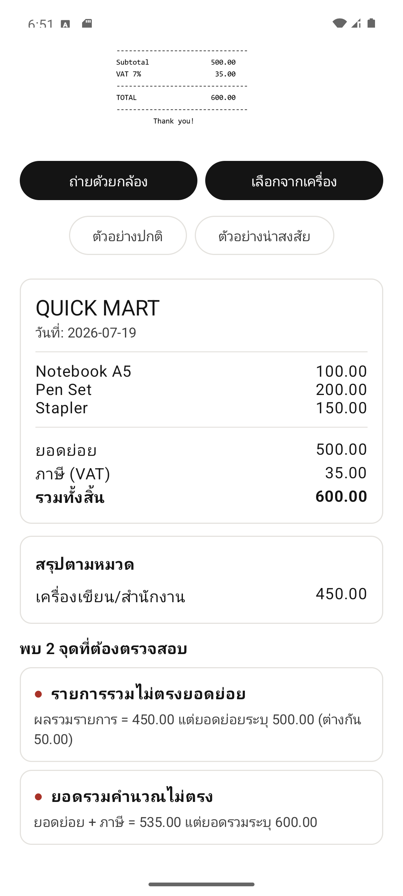

# ReceiptLens

An Android app that scans a receipt, reads it, and checks it for mistakes, entirely on the phone. No internet, no servers, nothing leaves the device.

## Screenshots

<table>
  <tr>
    <td></td>
    <td></td>
  </tr>
  <tr>
    <td align="center">A receipt read and grouped by category, on-device</td>
    <td align="center">The auditor flags a receipt whose totals do not add up</td>
  </tr>
</table>

## What it does

- **Scan** a receipt with the camera, or pick a photo from the gallery.
- **Read** the text on-device with ML Kit OCR (works offline).
- **Rebuild** the receipt into structured data — store, date, line items, subtotal, tax, total — using the position of each word, not just its reading order.
- **Audit** the receipt for problems: line items that don't add up to the subtotal, a total that doesn't match subtotal plus tax, an unusual tax rate, duplicate lines, and more.
- **Group** spending by category.

Every step runs on the device. The app requests no network permission and sends nothing to a server.

## Why on-device

Financial data is sensitive. Most scanner apps send the image or the extracted text to a cloud service to process it. ReceiptLens does all of it locally, so the data never leaves the phone. That is a deliberate design choice, not a limitation.

## How it works

```
Camera / Gallery
      │
      ▼
ML Kit OCR (on-device)      →  lines of text + their positions on the image
      │
      ▼
Parser (plain Kotlin)       →  groups words into rows by vertical overlap,
      │                        then reads store / date / items / totals
      ▼
Audit engine (plain Kotlin) →  flags anomalies, each with a severity level
      │
      ▼
Categorizer                 →  groups spending by category
```

The parser and the audit engine use **no AI** — they are plain, deterministic Kotlin. The only machine-learning step is the OCR, and it runs on-device. This keeps the results predictable and testable, and keeps everything private.

## Tech stack

- Kotlin, Jetpack Compose (Material 3)
- ML Kit Text Recognition (bundled, on-device)
- CameraX (in-app camera)
- Android Photo Picker (no storage permission needed)
- minSdk 24, compileSdk 37

## Architecture

The code is split into small, single-purpose layers, each behind an interface so a piece can be swapped without touching the rest:

- `ocr/` — reads text from a bitmap (`ReceiptTextReader` → `MlKitTextReader`).
- `parser/` — turns OCR output into a `Receipt`.
- `audit/` — runs a set of checks and returns findings.
- `category/` — groups items (`Categorizer` → `RuleCategorizer`; ready to swap in an on-device LLM later).
- `data/` — the domain types.
- `ui/` — Compose screens and the camera.

## Build and run

1. Open the project in Android Studio.
2. Let Gradle sync (it downloads the dependencies).
3. Run on an emulator or a device (Android 7.0 or newer).

Two sample receipts are built in — one clean, one with planted errors — so you can see the audit work without a real receipt.

## Roadmap

- Swap the rule-based categorizer for an on-device LLM (Gemini Nano) on supported devices.
- Handle photo rotation from real phone cameras.
- Keep a history of scanned receipts.

## Author

Built by Phisit — [@Vl4dimirz](https://github.com/Vl4dimirz)
